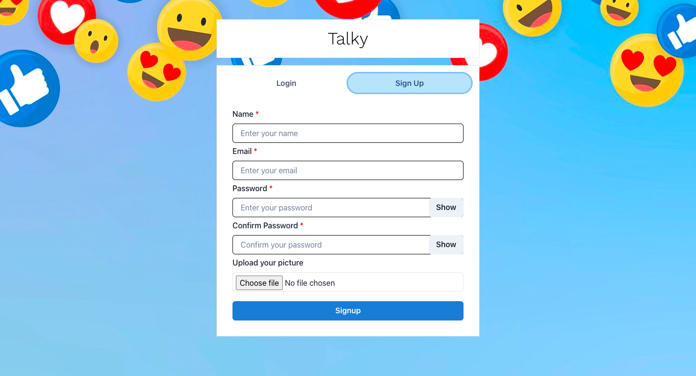
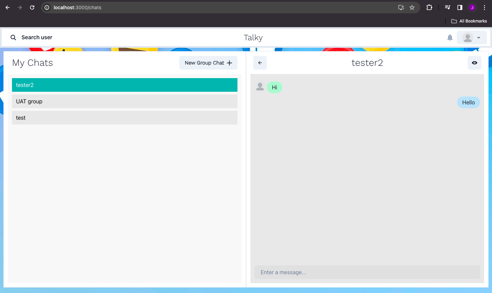
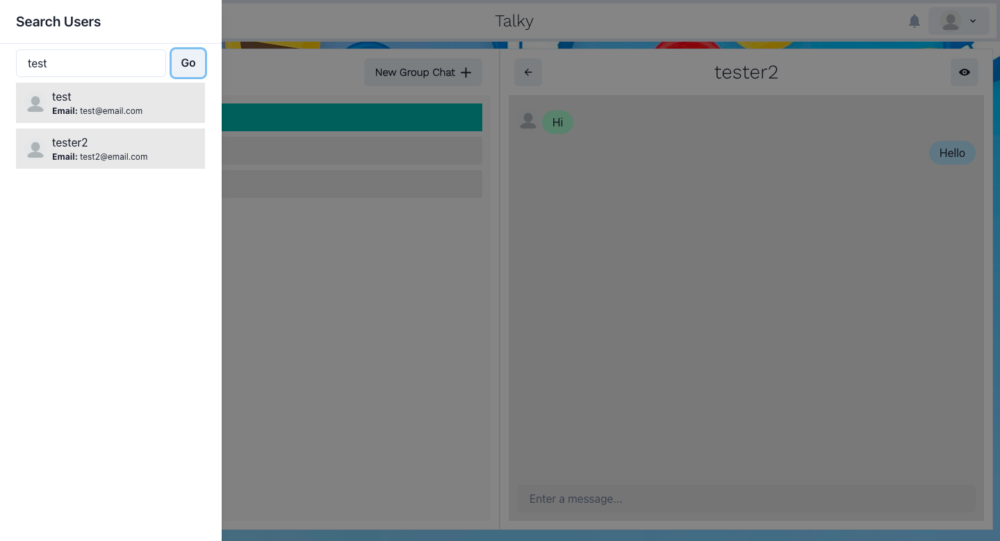

<h1 align="center">
  Talky
</h1>

## Overview

Chat with friends or create your groups with your buddies.
Developed as a personal project, created using [React](https://react.dev/) and [Node](https://nodejs.org/en).

## Screenshot

<p justifyContent="space-between" >
   
   
</p>

<p justifyContent="space-between" >
   
   
</p>
  
<!-- <p justifyContent="space-between" >
   
   
</p> -->


## Features

- Login/Singup user
- Create groups for chat
- Search users for chat
- Single chat options
- Used sockets for ontime results
- and many more

## Installation

Make sure you have setup node environment

Clone this repo

```
$ git clone https://github.com/jiteshs7/chatApp
$ cd chatApp
```

Run frontend or backend

`(frontend)`
$ npm start

````

``` (backedn) ```
$ npm run dev
````
